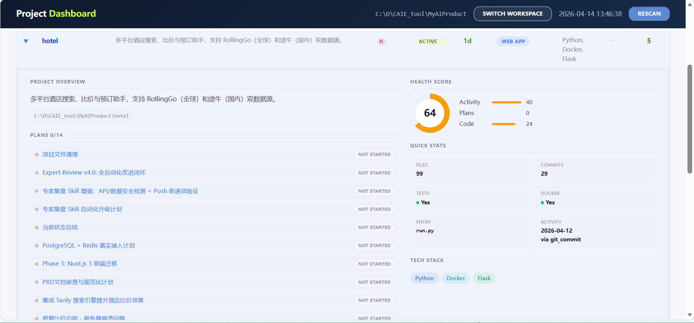

# devBoard

A generic project dashboard that scans a workspace directory, detects sub-projects (tech stack, git status, versions, TODOs), and presents them in a web UI with Claude Code plan integration.

## Features

- **Auto-detection**: Scans workspace for sub-projects, detecting tech stack, git status, versions, entry points, and TODO counts
- **Claude Code plans**: Parses `~/.claude/plans/` and links plans to projects by keyword matching
- **Category grouping**: Projects grouped by configurable categories with custom ordering
- **Status tracking**: Derives project status (active/stale/complete) from activity signals, with manual override
- **Plan status management**: Mark plans as not started, in progress, completed, or soft-deleted
- **Filtering & search**: Filter by status, search across project names, descriptions, and plans
- **Expandable detail panels**: Click to expand Health Score, Plans progress, Quick Stats, and Next Steps
- **Inline editing**: Change Priority (H/M/L) and Status directly in the table, values persist across scans
- **Column sorting**: Click any column header to sort within groups
- **Configurable workspace**: Set workspace path via browser, persists across restarts
- **Modern UI**: Dark navy header + light body design, Sentry-inspired blue color system with green status accents

## Screenshot



## Quick Start

```bash
# Start server (default port 9999)
python -m dashboard.server

# Custom port
DASHBOARD_PORT=8080 python -m dashboard.server

# CLI-only scan (writes data/dashboard.json, no server)
python -m dashboard.scanner
```

Open http://localhost:9999 and enter your workspace directory path.

## Requirements

- Python 3.8+
- Flask
- Markdown

```bash
pip install flask markdown
```

## Architecture

```
dashboard/
├── config.py    # Workspace config, persistence, migration
├── scanner.py   # Stateless scanning engine (pure functions)
├── server.py    # Flask routes, merges scanner output with user edits
└── templates/   # Jinja2 HTML (dashboard, setup, plan_detail)
```

**Data flow**: Config -> Scanner -> Server -> Browser

1. User sets workspace path via `/setup` page
2. Scanner walks the workspace, detects projects and plans
3. Server merges scan data with user-edited statuses
4. Dashboard renders grouped, filterable project table

### Design System

The UI follows a **dark header + light body** pattern, inspired by the Sentry design system with a blue color palette:

| Element | Color | Role |
|---------|-------|------|
| Header | `#0f1a2e` -> `#162a48` | Navy gradient, sticky top bar |
| Interactive | `#3b82f6` | Links, filters, active states |
| Active status | `#3d7a10` / `#eef7dd` | Green accent for active projects |
| Stale status | `#b56e1a` / `#fef3e6` | Orange accent for stale projects |
| Body background | `#f5f7fb` | Light blue-tinted white |
| Cards/surfaces | `#ffffff` | Pure white with subtle shadows |

### Data files (in `data/`, gitignored)

| File | Purpose |
|------|---------|
| `app_config.json` | Workspace path, project metadata, category order |
| `dashboard.json` | Full scan output (regenerated each scan) |
| `plans_status.json` | User-edited plan statuses (preserved across scans) |

## API

| Method | Endpoint | Description |
|--------|----------|-------------|
| GET | `/` | Dashboard (redirects to `/setup` if no workspace) |
| GET | `/setup` | Workspace configuration page |
| POST | `/scan` | Trigger rescan |
| GET | `/plan/<filename>` | View single plan rendered as HTML |
| GET | `/api/workspace` | Get workspace info |
| POST | `/api/workspace` | Set workspace path (triggers scan) |
| DELETE | `/api/workspace` | Reset workspace |
| PATCH | `/api/plan/<filename>/status` | Update plan status |
| PATCH | `/api/project/<name>/priority` | Update project priority (high/medium/low) |
| PATCH | `/api/project/<name>/status` | Update project status override |
| GET | `/api/data` | Raw JSON scan data |

## License

MIT
